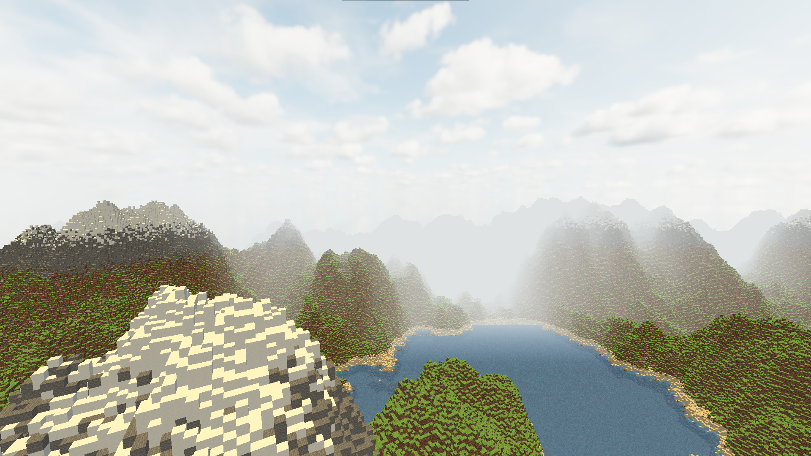
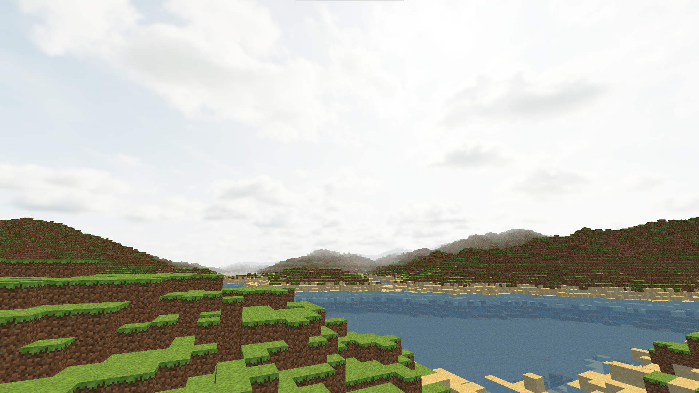
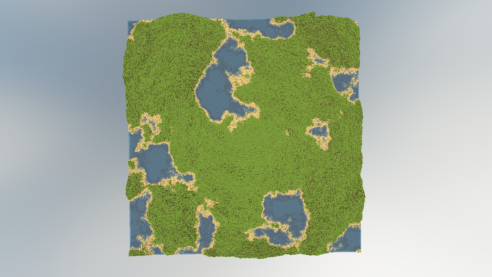

# voxel-engine
A simple multithreaded voxel engine written in C++ and OpenGL.

## Table of Contents
- [Cloning](#cloning)
- [Building](#building)
- [About](#about)
- [Controls](#controls)
- [Configuration](#configuration)
- [Screenshots](#screenshots)
- [Notes](#notes)

## Cloning
```bash
git clone --recursive
```

## Building
```bash
mkdir build
cd build
cmake ..
cmake --build . -j 8
```

## About
Written in C++ and OpenGL, this simple cross-platform engine demonstrates basic terrain generation using gradient noises
such as open simplex noise. It features simple diffused lighting and a Skybox, which are all customizable in the config file.

## Controls
- `W`, `A`, `S`, `D`: Move forward, left, backward, right
- `Space`: Move up
- `Left Shift`: Move down
- `Mouse Movement`: Look around
- `Esc`: Exit the application
- `P`: Enable wireframe mode
- `O`: Disable wireframe mode

## Configuration
The engine can be configured via the `config.json` file located in the resource folder of the application. 

## Screenshots
Here are some screenshots to showcase what the engine can achieve.

### Mountains


### Plains


### Top View


## Notes
- This project is made to run on OpenGL 4.6. Make sure you have the necessary drivers installed.
- This project is only made for the sole purpose of education and experimentation. The codebase is definitely not optimized to run on lower end systems.